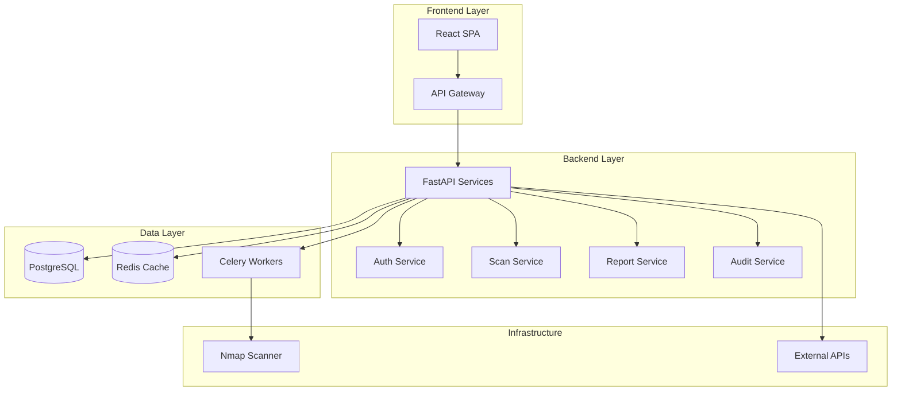
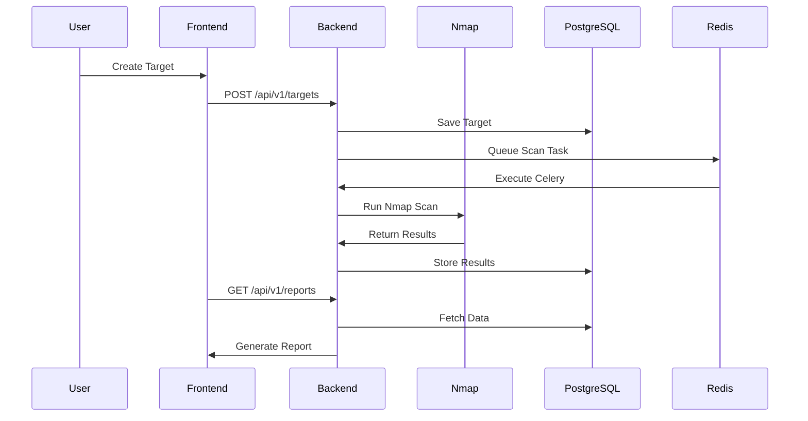
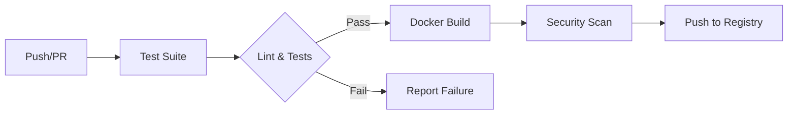

# Project-Helios

<p align="center">


</p>
</a>

> Next-Generation Security Reconnaissance Platform

SentinelRecon is a professional open-source security reconnaissance platform designed for modern SOC environments. Built with enterprise-grade technologies, it provides automated infrastructure scanning, real-time monitoring, and comprehensive reporting capabilities.

## 🚀 Features

- **SOC Dashboard**: Real-time security operations center with animated visualizations
- **Target Management**: Multi-type target support (IP, Domain, CIDR)
- **Nmap Integration**: Full-featured scanner engine with parallel execution
- **Report Generation**: PDF, CSV, and JSON exports with executive summaries
- **Audit Trail**: Complete activity logging for compliance
- **Role-Based Access**: Admin, Analyst, and Viewer roles
- **REST API**: Versioned OpenAPI documentation
- **Real-time Updates**: WebSocket-powered live monitoring

## 🏗️ Architecture



## 📊 Data Flow



## 🚢 CI/CD Pipeline



## 📦 Tech Stack

### Backend

- Python 3.13
- FastAPI
- SQLAlchemy 2.0
- Alembic
- PostgreSQL
- Redis
- Celery
- JWT Authentication
- Pydantic V2

### Frontend

- React 18
- TypeScript 5
- Vite 5
- TailwindCSS
- Framer Motion
- Recharts
- Zustand

### Infrastructure

- Docker & Docker Compose
- GitHub Actions
- CodeQL Security Analysis
- Dependabot

## 🔧 Quick Start

### Using Docker

```bash
git clone https://github.com/cybersecurity-sentinel/sentinelrecon.git
cd sentinelrecon
docker compose up -d
```

Access the platform at `http://localhost:3000`

### Manual Installation

**Backend:**

```bash
cd backend
python -m venv venv
.\venv\Scripts\activate  # Windows
source venv/bin/activate  # Linux/macOS
pip install -r requirements.txt
uvicorn app.main:app --reload
```

**Frontend:**

```bash
cd frontend
npm install
npm run dev
```

## 📚 Documentation

- [Architecture](docs/architecture/README.md)
- [API Reference](docs/api/README.md)
- [Deployment Guide](docs/deployment/README.md)
- [Security Model](docs/security/README.md)

## 🛠️ Development

```bash
# Run linting
ruff check backend/
black --check backend/
mypy backend/

# Run tests
pytest backend/tests/
npm run test frontend/
```

## 🤝 Contributing

See [CONTRIBUTING.md](CONTRIBUTING.md) for guidelines.

## 🔒 Security

See [SECURITY.md](SECURITY.md) for security policy.

## 🗺️ Roadmap

| Version | Milestone | Status |
|---------|-----------|--------|
| v0.1.0 | Foundation | ✅ Complete |
| v0.2.0 | Authentication | ✅ Complete |
| v0.3.0 | Scan Engine | ✅ Complete |
| v0.4.0 | Dashboard | ✅ Complete |
| v0.5.0 | Reports | ✅ Complete |
| v0.6.0 | Multi User | ✅ Complete |
| v1.0.0 | Production Release | 🚧 In Progress |

## 📄 License

MIT License - see [LICENSE](LICENSE)

## 🙏 Acknowledgments

Developed by the SentinelRecon Team.
Logo designed for cybersecurity professionals.